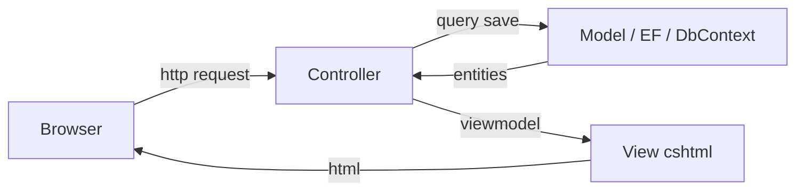
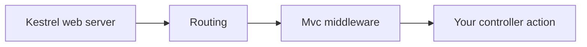

# architecture — asp.net core mvc (mental model)

This is the **shape** of the app the assignment asks for: **MVC** + **EF Core** + **browser** UI.

---

## mvc triangle (who talks to whom)

**rule of thumb for class:** the **controller** loads data from the database and picks a **view**. the **view** should not open the database by itself (there are advanced exceptions; ignore them until the course introduces them).

---

## request pipeline (one line per hop)

you do not need to memorize middleware order for this assignment. **do** remember: **url → controller/action → code runs → returns view or redirect**.

---

## folders you will see

| typical folder | purpose |
|----------------|---------|
| `Controllers/` | classes with `public IActionResult ...` methods |
| `Views/` | `.cshtml` razor templates; subfolders match controller names by convention |
| `Models/` | entity classes + sometimes viewmodels |
| `wwwroot/` | static files: css, js, images |

**convention:** `HomeController` → `Views/Home/Index.cshtml`. if you rename, routing must still match.

---

## iactionresult types you will use

- `View()` — render a `.cshtml` page.  
- `RedirectToAction(...)` — browser goes to another action (readme wants this after create/add).  
- `NotFound()` — optional if id invalid.  

---

## ef core placement

- `DbContext` subclass (often named `FourthWallCafeContext` or similar) lives in `Models/` or `Data/`.  
- **connection string** in `appsettings.json` (do **not** commit secrets to public repos).

---

## where linq shows up

- controllers (or services) query `context.CafeOrders.Where(...)` etc.  
- that is the “linq” part of the assignment.
