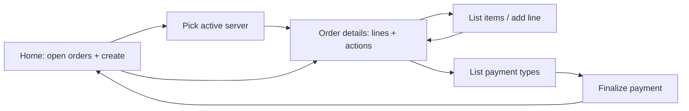

# workflow map — readme vs sample interactions

the course readme has two sections that **sound** like different apps: **application pages** and **sample interactions**. your instructor said: treat **sample interactions** + a sensible **screen map** as truth if they conflict.

this file lines them up.

---

## big picture flow

---

## where readme wording conflicts

| readme “application pages” line | what actually happens (sample + instructor) |
|---------------------------------|--------------------------------------------|
| “selecting a server navigates to the **order creation form**” | often you go straight to **details** after picking server (details may have **no items** yet). a separate “form” page is optional. |
| “order creation form, once submitted, creates…” | create can happen **when you confirm server** or via a small form; end state is **order exists** + **details** shows it. |

**rule:** if you can do **sample interaction “creating a new order”** end-to-end, you are aligned.

---

## sample interaction → suggested routes (names are examples)

you can rename; keep **one clear path** per step.

| step | user sees | controller idea | success signal |
|------|-----------|-----------------|----------------|
| create: click create | server list | `OrderController` / `New` | servers query runs |
| create: pick server | redirect | `Create` post | new `CafeOrder` row, `RedirectToAction("Details", new { id })` |
| view open | home list | `Home/Index` | only `PaymentTypeID == null` |
| open: pick order | details | `Order/Details` | items for `OrderID` |
| add items | item list | `Order/AddItem` get | shows `Item` (or priced rows) |
| add items: click item | redirect | `AddItem` post | new `OrderItem`, redirect details |
| pay | payment list | `Order/Payment` get | lists `PaymentType` |
| pay: form submit | home | `Payment` post | sets `PaymentTypeID`, redirect home |

---

## “four views” vs more pages

the readme bullets can imply **four** screens. in practice you may have **more cshtml files** (layout, partials, separate add-item page, payment form page). that is fine. graders follow **behavior**, not a four-file quota.

---

## database names (mental anchor)

- open order: `CafeOrder.PaymentTypeID` **is null**  
- see [DATA_MODEL.md](DATA_MODEL.md) for `OrderItem` / `ItemPriceID` nuance  
